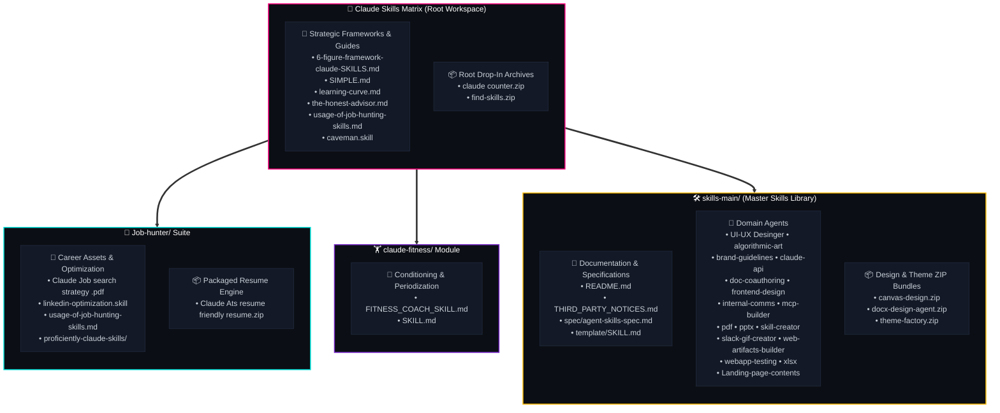

<div align="center">

<!-- ================================================================= -->
<!-- 🚀 ANIMATED RETRO CYBERPUNK & DYNAMIC MOTION HERO HEADER -->
<!-- ================================================================= -->
<svg xmlns="http://www.w3.org/2000/svg" viewBox="0 0 950 260" width="100%" height="260" style="background: #090d16; border-radius: 18px; box-shadow: 0 12px 40px rgba(0, 0, 0, 0.75); overflow: hidden; border: 1px solid rgba(121, 40, 202, 0.35);">
  <defs>
    <!-- Shifting Neon Gradients -->
    <linearGradient id="neonPulse" x1="0%" y1="0%" x2="100%" y2="100%">
      <stop offset="0%" stop-color="#ff007f">
        <animate attributeName="stop-color" values="#ff007f;#7928ca;#00dfd8;#ffbe0b;#ff007f" dur="9s" repeatCount="indefinite" />
      </stop>
      <stop offset="40%" stop-color="#7928ca">
        <animate attributeName="stop-color" values="#7928ca;#00dfd8;#ffbe0b;#ff007f;#7928ca" dur="9s" repeatCount="indefinite" />
      </stop>
      <stop offset="75%" stop-color="#00dfd8">
        <animate attributeName="stop-color" values="#00dfd8;#ffbe0b;#ff007f;#7928ca;#00dfd8" dur="9s" repeatCount="indefinite" />
      </stop>
      <stop offset="100%" stop-color="#ffbe0b">
        <animate attributeName="stop-color" values="#ffbe0b;#ff007f;#7928ca;#00dfd8;#ffbe0b" dur="9s" repeatCount="indefinite" />
      </stop>
    </linearGradient>
  </defs>
  <!-- Background Base & Sci-Fi Grid -->
  <rect width="950" height="260" fill="#090d16" />
  <rect width="950" height="260" fill="url(#cyberGrid)" />
  <rect y="130" width="950" height="130" fill="url(#horizonGlow)" />

  <!-- Animated Cyber Laser Lines -->
  <line x1="0" y1="195" x2="950" y2="195" stroke="#7928ca" stroke-width="1.6" stroke-opacity="0.5" class="laser-line" />
  <line x1="0" y1="220" x2="950" y2="220" stroke="#00dfd8" stroke-width="1.2" stroke-opacity="0.4" class="laser-line-fast" />
  <line x1="0" y1="242" x2="950" y2="242" stroke="#ff007f" stroke-width="0.8" stroke-opacity="0.3" class="laser-line" />

  <!-- Animated Soundwave / Equalizer Left -->
  <g transform="translate(35, 170) scale(1, -1)">
    <rect x="0" y="0" width="4" height="28" fill="#ff007f" rx="2" class="eq-bar" style="animation-delay: 0.1s;"/>
    <rect x="7" y="0" width="4" height="42" fill="#7928ca" rx="2" class="eq-bar" style="animation-delay: 0.35s;"/>
    <rect x="14" y="0" width="4" height="22" fill="#00dfd8" rx="2" class="eq-bar" style="animation-delay: 0.6s;"/>
    <rect x="21" y="0" width="4" height="36" fill="#ffbe0b" rx="2" class="eq-bar" style="animation-delay: 0.25s;"/>
    <rect x="28" y="0" width="4" height="18" fill="#ff007f" rx="2" class="eq-bar" style="animation-delay: 0.5s;"/>
  </g>

  <!-- Animated Soundwave / Equalizer Right -->
  <g transform="translate(885, 170) scale(1, -1)">
    <rect x="0" y="0" width="4" height="20" fill="#ff007f" rx="2" class="eq-bar" style="animation-delay: 0.45s;"/>
    <rect x="7" y="0" width="4" height="38" fill="#7928ca" rx="2" class="eq-bar" style="animation-delay: 0.2s;"/>
    <rect x="14" y="0" width="4" height="24" fill="#00dfd8" rx="2" class="eq-bar" style="animation-delay: 0.55s;"/>
    <rect x="21" y="0" width="4" height="44" fill="#ffbe0b" rx="2" class="eq-bar" style="animation-delay: 0.1s;"/>
    <rect x="28" y="0" width="4" height="16" fill="#ff007f" rx="2" class="eq-bar" style="animation-delay: 0.4s;"/>
  </g>

  <!-- Twinkling Micro Stars -->
  <g class="star-glow" style="transform-origin: 140px 48px;"><rect x="138" y="46" width="6" height="6" rx="2" fill="#00dfd8" /></g>
  <g class="star-glow" style="transform-origin: 820px 45px; animation-delay: 0.8s;"><rect x="817" y="42" width="7" height="7" rx="2" fill="#ff007f" /></g>
  <g class="star-glow" style="transform-origin: 870px 135px; animation-delay: 1.4s;"><rect x="868" y="133" width="5" height="5" rx="1.5" fill="#7928ca" /></g>
  <g class="star-glow" style="transform-origin: 75px 125px; animation-delay: 1.1s;"><rect x="73" y="123" width="6" height="6" rx="2" fill="#ffbe0b" /></g>

  <!-- Left Floating Cyber Sprite -->
  <g class="floating-box-1" transform="translate(50, 48)">
    <rect x="0" y="0" width="52" height="52" rx="12" fill="#131926" stroke="url(#neonPulse)" stroke-width="2.2" />
    <circle cx="18" cy="20" r="4" fill="#00dfd8" />
    <circle cx="34" cy="20" r="4" fill="#00dfd8" />
    <rect x="16" y="34" width="20" height="4" rx="2" fill="#ff007f" />
    <polygon points="26,6 30,12 22,12" fill="#ffbe0b" />
  </g>

  <!-- Right Floating Skill Prism -->
  <g class="floating-box-2" transform="translate(845, 48)">
    <rect x="0" y="0" width="52" height="52" rx="12" fill="#131926" stroke="url(#neonPulse)" stroke-width="2.2" />
    <polygon points="26,10 42,26 26,42 10,26" fill="none" stroke="#00dfd8" stroke-width="2.2">
      <animateTransform attributeName="transform" type="rotate" from="0 26 26" to="360 26 26" dur="7s" repeatCount="indefinite"/>
    </polygon>
    <circle cx="26" cy="26" r="4" fill="#ff007f">
      <animate attributeName="r" values="3;5.5;3" dur="2.2s" repeatCount="indefinite" />
    </circle>
      </g>

<!-- ================================================================= -->
<!-- 💎 BADGE ROW & TELEMETRY STRIP -->
<!-- ================================================================= -->
<p align="center" style="margin-top: 14px;">
  
  
  
  
  
</p>

<!-- ================================================================= -->
<!-- 📊 ANIMATED TELEMETRY DASHBOARD BAR (SVG) -->
<!-- ================================================================= -->
<svg xmlns="http://www.w3.org/2000/svg" viewBox="0 0 950 95" width="100%" height="95" style="background: #0f1422; border-radius: 14px; border: 1px solid rgba(0, 223, 216, 0.25); box-shadow: 0 4px 20px rgba(0,0,0,0.5);">
  <style>
    .pod-title { font-family: 'Segoe UI', sans-serif; font-size: 11px; font-weight: 700; fill: #8b949e; letter-spacing: 1.5px; text-transform: uppercase; }
    .pod-value { font-family: 'Segoe UI', monospace; font-size: 18px; font-weight: 900; fill: #ffffff; letter-spacing: 1px; }
    .pod-glow-1 { fill: #ff007f; }
    .pod-glow-2 { fill: #00dfd8; }
    .pod-glow-3 { fill: #7928ca; }
    .pod-glow-4 { fill: #ffbe0b; }
    .pulse-dot { animation: pulseIndicator 1.8s ease-in-out infinite; }
    @keyframes pulseIndicator { 0%, 100% { opacity: 0.3; } 50% { opacity: 1; } }
  </style>

  <!-- Telemetry Pod 1: Skills -->
  <g transform="translate(30, 18)">
    <rect width="200" height="60" rx="10" fill="#161e31" stroke="rgba(255, 0, 127, 0.35)" stroke-width="1.2"/>
    <circle cx="22" cy="30" r="4.5" class="pod-glow-1 pulse-dot"/>
    <text x="36" y="26" class="pod-title">Domain Skills</text>
    <text x="36" y="48" class="pod-value">19+ Modules</text>
  </g>

  <!-- Telemetry Pod 2: Preserved ZIPs -->
  <g transform="translate(260, 18)">
    <rect width="200" height="60" rx="10" fill="#161e31" stroke="rgba(0, 223, 216, 0.35)" stroke-width="1.2"/>
    <circle cx="22" cy="30" r="4.5" class="pod-glow-2 pulse-dot" style="animation-delay: 0.4s;"/>
    <text x="36" y="26" class="pod-title">Drop-in ZIPs</text>
    <text x="36" y="48" class="pod-value">6 Preserved</text>
  </g>

  <!-- Telemetry Pod 3: Polyglot SDKs -->
  <g transform="translate(490, 18)">
    <rect width="200" height="60" rx="10" fill="#161e31" stroke="rgba(121, 40, 202, 0.35)" stroke-width="1.2"/>
    <circle cx="22" cy="30" r="4.5" class="pod-glow-3 pulse-dot" style="animation-delay: 0.8s;"/>
    <text x="36" y="26" class="pod-title">SDK Runtimes</text>
    <text x="36" y="48" class="pod-value">8 Languages</text>
  </g>

  <!-- Telemetry Pod 4: Zero Extraction -->
  <g transform="translate(720, 18)">
    <rect width="200" height="60" rx="10" fill="#161e31" stroke="rgba(255, 190, 11, 0.35)" stroke-width="1.2"/>
    <circle cx="22" cy="30" r="4.5" class="pod-glow-4 pulse-dot" style="animation-delay: 1.2s;"/>
    <text x="36" y="26" class="pod-title">Extraction Needed</text>
    <text x="36" y="48" class="pod-value">0% (Pure ZIPs)</text>
  </g>
</svg>

</div>

---

## 🌟 Transform Ordinary LLMs into Elite Autonomous Specialists

Imagine handing your AI not just a vague prompt, but **complete mastery over end-to-end engineering, creative design, executive communication, and high-stakes career strategy**. 

The **Claude Skills Ecosystem** transforms standard LLM interactions into structured, high-precision agentic executions. Whether you are running **Claude Code**, **Claude.ai**, **Gemini CLI**, **Cursor**, or autonomous agent loops, these blueprints furnish your assistants with:

- 🎯 **Deep Context Awareness**: Multi-step reasoning loops tailored for complex deliverables.
- 🎨 **Visual & Media Mastery**: Automated PowerPoint generation, interactive HTML5 Canvas art, vector manipulation, and responsive web design.
- 💼 **Career Acceleration**: Strategic ATS-proof resumes, high-conversion LinkedIn workflows, and executive compensation advisory.
- 🛠️ **Systems-Grade Engineering**: Polyglot SDK patterns across 8+ programming languages, custom Model Context Protocol (MCP) servers, and robust E2E testing pipelines.

> [!IMPORTANT]
> ### 📦 Preserved Drop-In ZIP Guarantee
> **All `.zip` archives in this repository are intentionally kept sealed in their original compressed state!**
> There is **no need to unzip any files**. Modern AI environments, plugin runners, and custom tools ingest these archives directly as clean, portable, zero-clutter execution bundles.

---

## ⚡ Motion & Architecture Map



---

## 📁 Itemized Repository Directory & File Inventory

Every component in this repository is cataloged below with exact names, locations, and clickable relative links:

### 1. 🌐 Root Ecosystem Components

| Component / Artifact | Type | Status & Purpose |
|---|:---:|---|
| [`6-figure-framework-claude-SKILLS.md`](./6-figure-framework-claude-SKILLS.md) | `File` | 💎 Master framework for designing enterprise consulting and high-value AI solutions |
| [`SIMPLE.md`](./SIMPLE.md) | `File` | ⚡ Minimalist execution philosophy, core principles, and rapid-dispatch guidelines |
| [`learning-curve.md`](./learning-curve.md) | `File` | 📈 Step-by-step adoption curve and skill acquisition roadmap for agent operators |
| [`the-honest-advisor.md`](./the-honest-advisor.md) | `File` | 🎯 High-candor, unfiltered strategic advisory persona for architecture & product vetting |
| [`usage-of-job-hunting-skills.md`](./usage-of-job-hunting-skills.md) | `File` | 🚀 Root quickstart manual for deploying career acceleration automation |
| [`caveman.skill`](./caveman.skill) | `File` | 🦴 Ultra-compact, token-efficient persona delivering maximum information per byte |
| [`claude counter.zip`](./claude%20counter.zip) | `Zip Archive` | 📦 **[Preserved ZIP]** Automated interaction and token analytics telemetry bundle |
| [`find-skills.zip`](./find-skills.zip) | `Zip Archive` | 📦 **[Preserved ZIP]** Search indexer and skill discovery dispatch module |
| [`Job-hunter`](./Job-hunter) | `Directory` | 💼 Dedicated suite for career advancement, resume building, and job search strategy |
| [`claude-fitness`](./claude-fitness) | `Directory` | 🏋️ Comprehensive athletic coaching, workout programming, and nutrition advisor |
| [`skills-main`](./skills-main) | `Directory` | 🛠️ Master library containing 19+ specialized domain skills and drop-in design packages |
| [`README.md`](./README.md) | `File` | 🌟 The central command dashboard, animated portal, and ecosystem roadmap |

---

### 2. 💼 `Job-hunter/` Career Acceleration Suite

Engineered to give job seekers an unfair advantage in ATS filtering, recruiter outreach, and interview negotiations.

| Artifact Name | Type | Key Capabilities |
|---|:---:|---|
| [`Claude Ats resume friendly resume.zip`](./Job-hunter/Claude%20Ats%20resume%20friendly%20resume.zip) | `Zip Archive` | 📦 **[Preserved ZIP]** Battle-tested ATS-compliant resume templates and generators |
| [`Claude Job search strategy .pdf`](./Job-hunter/Claude%20Job%20search%20strategy%20.pdf) | `PDF File` | 🗺️ Comprehensive architectural playbook for structured corporate job hunting |
| [`linkedin-optimization.skill`](./Job-hunter/linkedin-optimization.skill) | `Skill File` | 🔍 Algorithm-optimized headline generator, summary crafter, and engagement booster |
| [`usage-of-job-hunting-skills.md`](./Job-hunter/usage-of-job-hunting-skills.md) | `File` | 📖 Granular, step-by-step execution workflows for the entire Job Hunter suite |
| [`proficiently-claude-skills/`](./Job-hunter/proficiently-claude-skills) | `Directory` | 🗃️ Specialized career extension modules and supplementary scripts |

---

### 3. 🏋️ `claude-fitness/` High-Performance Health Module

A private, hyper-personalized fitness coach running directly inside your LLM context.

| Artifact Name | Type | Key Capabilities |
|---|:---:|---|
| [`FITNESS_COACH_SKILL.md`](./claude-fitness/FITNESS_COACH_SKILL.md) | `File` | 🥩 Hypertrophy, endurance periodization, macro calculations, and recovery protocols |
| [`SKILL.md`](./claude-fitness/SKILL.md) | `File` | 📋 Daily workout planner, progressive overload tracker, and lifestyle audit engine |

---

### 4. 🛠️ `skills-main/` Core Skills Matrix

Located at [`skills-main/skills-main/skills`](./skills-main/skills-main/skills), representing a powerhouse collection of autonomous domain skills:

```
skills-main/skills-main/
├── README.md                                  # Library overview and foundational setup
├── THIRD_PARTY_NOTICES.md                     # Open-source licensing and attribution
├── spec/
│   └── agent-skills-spec.md                   # Formal specifications for skill schemas
├── template/
│   └── SKILL.md                               # Gold-standard template for authoring new skills
└── skills/
    ├── canvas-design.zip                      # 📦 [ZIP] HTML5 Canvas graphics & particle engine
    ├── docx-design-agent.zip                  # 📦 [ZIP] Enterprise DOCX styling & document engine
    ├── theme-factory.zip                      # 📦 [ZIP] Color harmony token generator & dark/light palettes
    ├── Landing-page-contents/                 # 🌐 Conversion copywriting & landing page architecture
    │   └── usage-of-job-hunting-skills.md
    ├── UI-UX Desinger/                        # 🎨 Wireframing, UX heuristics, and micro-interactions
    │   └── SKILL.md
    ├── algorithmic-art/                       # 🪄 Generative p5.js, math visualizations & SVG shaders
    │   └── SKILL.md
    ├── brand-guidelines/                      # 🛡️ Corporate brand voice, typography & palette auditor
    │   └── SKILL.md
    ├── claude-api/                            # ⚡ Polyglot SDK guides (Python, TS, Go, Java, C#, PHP, Ruby, cURL)
    │   └── SKILL.md
    ├── doc-coauthoring/                       # ✍️ Pair-writing, technical RFC drafting & editorial revision
    │   └── SKILL.md
    ├── frontend-design/                       # 💻 Modern responsive HTML, Tailwind CSS & clean layouts
    │   └── SKILL.md
    ├── internal-comms/                        # 📢 Leadership updates, team newsletters & critical memos
    │   └── SKILL.md
    ├── mcp-builder/                           # 🔌 Model Context Protocol server development kit
    │   └── SKILL.md
    ├── pdf/                                   # 📑 PDF extraction, structural manipulation & report synthesis
    │   └── SKILL.md
    ├── pptx/                                  # 📊 Automated PowerPoint slide decks via pptxgenjs
    │   └── SKILL.md
    ├── skill-creator/                         # 🧠 Meta-agent for authoring, evaluating & packaging skills
    │   └── SKILL.md
    ├── slack-gif-creator/                     # 👾 Animated retro pixel reaction GIFs for team workspaces
    │   └── SKILL.md
    ├── web-artifacts-builder/                 # ⚛️ Interactive React/HTML Claude artifacts generator
    │   └── SKILL.md
    ├── webapp-testing/                        # 🧪 Playwright & E2E regression testing testbed
    │   └── SKILL.md
    └── xlsx/                                  # 📈 Complex Excel formulas, financial projections & pivot models
        └── SKILL.md
```

---

## 🎮 Interactive Skills Navigator

Explore skills by functional domain. Click each category to view details and access the underlying blueprints:

<details>
<summary><b>🎨 Visual, UI/UX & Creative Engineering (Click to Expand)</b></summary>
<br/>

| Skill | Primary File / Package | Superpower |
|---|---|---|
| **Frontend Design** | [`SKILL.md`](./skills-main/skills-main/skills/frontend-design/SKILL.md) | Produces modern, accessible, clean Tailwind/HTML responsive interfaces |
| **UI/UX Designer** | [`SKILL.md`](./skills-main/skills-main/skills/UI-UX%20Desinger/SKILL.md) | Creates wireframes, interaction specs, and UX audit checklists |
| **Algorithmic Art** | [`SKILL.md`](./skills-main/skills-main/skills/algorithmic-art/SKILL.md) | Synthesizes generative math art, shaders, and dynamic canvas visuals |
| **Canvas Design** | [`canvas-design.zip`](./skills-main/skills-main/skills/canvas-design.zip) | 📦 *Preserved ZIP*: Ready-to-run HTML5 dynamic canvas particle engines |
| **Theme Factory** | [`theme-factory.zip`](./skills-main/skills-main/skills/theme-factory.zip) | 📦 *Preserved ZIP*: Automated design token generators and color harmony matrices |

</details>

<details>
<summary><b>📄 Document Automation, Media & Presentation Engines (Click to Expand)</b></summary>
<br/>

| Skill | Primary File / Package | Superpower |
|---|---|---|
| **PowerPoint Deck Builder** | [`SKILL.md`](./skills-main/skills-main/skills/pptx/SKILL.md) | Generates complete, beautifully formatted presentation decks programmatically |
| **PDF Engineering** | [`SKILL.md`](./skills-main/skills-main/skills/pdf/SKILL.md) | Parses, restructures, merges, and generates publication-grade PDFs |
| **Excel Spreadsheet Specialist**| [`SKILL.md`](./skills-main/skills-main/skills/xlsx/SKILL.md) | Formulates robust financial sheets, dynamic projections, and formulas |
| **DOCX Design Agent** | [`docx-design-agent.zip`](./skills-main/skills-main/skills/docx-design-agent.zip) | 📦 *Preserved ZIP*: Enterprise Word document layouts, typography & styling |
| **Slack GIF Creator** | [`SKILL.md`](./skills-main/skills-main/skills/slack-gif-creator/SKILL.md) | Crafts pixel-art animated GIFs and memes tailored for remote teams |

</details>

<details>
<summary><b>🚀 Developer Toolkits, APIs & Systems Architecture (Click to Expand)</b></summary>
<br/>

| Skill | Primary File / Package | Superpower |
|---|---|---|
| **Claude API Polyglot** | [`SKILL.md`](./skills-main/skills-main/skills/claude-api/SKILL.md) | Master reference for 8+ languages (Python, TS, Go, Java, PHP, C#, Ruby, cURL) |
| **MCP Server Builder** | [`SKILL.md`](./skills-main/skills-main/skills/mcp-builder/SKILL.md) | Scaffolds and validates standardized Model Context Protocol tool servers |
| **Web Artifacts Builder** | [`SKILL.md`](./skills-main/skills-main/skills/web-artifacts-builder/SKILL.md) | Builds self-contained, reactive single-page applications inside artifacts |
| **Web App E2E Testing** | [`SKILL.md`](./skills-main/skills-main/skills/webapp-testing/SKILL.md) | Writes and automates Playwright browser tests, regression flows, and assertions |
| **Skill Creator** | [`SKILL.md`](./skills-main/skills-main/skills/skill-creator/SKILL.md) | The ultimate meta-skill: Authors, tests, and evaluates brand-new skills |

</details>

<details>
<summary><b>✍️ Communication, Marketing & Content Strategy (Click to Expand)</b></summary>
<br/>

| Skill | Primary File / Package | Superpower |
|---|---|---|
| **Brand Guidelines** | [`SKILL.md`](./skills-main/skills-main/skills/brand-guidelines/SKILL.md) | Enforces consistent corporate voice, typography rules, and design integrity |
| **Document Co-Authoring** | [`SKILL.md`](./skills-main/skills-main/skills/doc-coauthoring/SKILL.md) | Facilitates iterative pair-writing for RFCs, technical specs, and whitepapers |
| **Internal Communications** | [`SKILL.md`](./skills-main/skills-main/skills/internal-comms/SKILL.md) | Crafts crisp executive memos, team announcements, and post-mortems |
| **Landing Page Content** | [`usage-of-job-hunting-skills.md`](./skills-main/skills-main/skills/Landing-page-contents/usage-of-job-hunting-skills.md) | Architectures high-converting landing page layouts and value propositions |

</details>

<details>
<summary><b>💼 Career Acceleration, Advisory & Athletic Frameworks (Click to Expand)</b></summary>
<br/>

| Framework | Primary File / Directory | Superpower |
|---|---|---|
| **6-Figure Consulting Blueprint** | [`6-figure-framework-claude-SKILLS.md`](./6-figure-framework-claude-SKILLS.md) | Architect high-ticket AI automation solutions for enterprise clients |
| **Job Hunter Career Suite** | [`Job-hunter`](./Job-hunter) | Full job hunting pipeline with ATS resumes, search strategy, and LinkedIn tools |
| **Claude Fitness Suite** | [`claude-fitness`](./claude-fitness) | Comprehensive workout periodization, strength cycles, and meal planning |
| **The Honest Advisor** | [`the-honest-advisor.md`](./the-honest-advisor.md) | Brutally honest feedback on startups, codebases, and strategic roadmaps |
| **Caveman Persona** | [`caveman.skill`](./caveman.skill) | Extreme token compression: concise, punchy, high-speed execution |
| **Adoption Learning Curve** | [`learning-curve.md`](./learning-curve.md) | Guided progression from basic prompt engineering to autonomous agent mastery |
| **SIMPLE Principles** | [`SIMPLE.md`](./SIMPLE.md) | Clean, friction-free cognitive frameworks for high-velocity output |

</details>

<details>
<summary><b>📦 Complete Index of All 6 Intact Drop-in ZIP Packages (Click to Expand)</b></summary>
<br/>

These packages remain compressed and ready for portable transport across environments:

1. **[`claude counter.zip`](./claude%20counter.zip)**: Token counting, rate-limit estimation, and context session tracker.
2. **[`find-skills.zip`](./find-skills.zip)**: Quick-search index generator to pinpoint skills matching any user query.
3. **[`Claude Ats resume friendly resume.zip`](./Job-hunter/Claude%20Ats%20resume%20friendly%20resume.zip)**: Word/PDF ATS resume templates tailored for algorithmic parsing.
4. **[`canvas-design.zip`](./skills-main/skills-main/skills/canvas-design.zip)**: Ready-to-use HTML5 interactive canvas graphics package.
5. **[`docx-design-agent.zip`](./skills-main/skills-main/skills/docx-design-agent.zip)**: Microsoft Word auto-formatting, header hierarchy, and styling agent.
6. **[`theme-factory.zip`](./skills-main/skills-main/skills/theme-factory.zip)**: Color token generator and WCAG-compliant design theme builder.

</details>

---

## ⚡ How to Activate Any Skill in Seconds

Activating any capability in this repository requires zero complicated installations:

### Method 1: Direct File Prompting (Claude Code / Cursor / Gemini)
Simply instruct your agent to adopt the specific skill instructions:
```markdown
Please review and follow the instructions located at:
./skills-main/skills-main/skills/frontend-design/SKILL.md

Now build a responsive hero section for a decentralized cloud platform.
```

### Method 2: Career Suite Activation
```markdown
Read the career strategy guide at ./Job-hunter/usage-of-job-hunting-skills.md
and optimize my LinkedIn headline according to ./Job-hunter/linkedin-optimization.skill.
```

### Method 3: Multi-Skill Chaining
Combine complementary skills for autonomous software delivery:
```markdown
Execute the following pipeline:
1. Use ./skills-main/skills-main/skills/mcp-builder/SKILL.md to build a GitHub MCP server.
2. Use ./skills-main/skills-main/skills/webapp-testing/SKILL.md to write Playwright verification tests.
```

---

<div align="center">

<!-- ANIMATED FOOTER BEAM -->
<svg xmlns="http://www.w3.org/2000/svg" viewBox="0 0 700 24" width="700" height="24" style="max-width: 100%;">
  <defs>
    <linearGradient id="footerBeam" x1="0%" y1="0%" x2="100%" y2="0%">
      <stop offset="0%" stop-color="#ff007f" stop-opacity="0" />
      <stop offset="50%" stop-color="#00dfd8" stop-opacity="1" />
      <stop offset="100%" stop-color="#7928ca" stop-opacity="0" />
    </linearGradient>
  </defs>
  <line x1="0" y1="12" x2="700" y2="12" stroke="url(#footerBeam)" stroke-width="2">
    <animate attributeName="stroke-dasharray" values="0,700;700,0;0,700" dur="4s" repeatCount="indefinite" />
  </line>
</svg>

<br/>

**⚡ Built for the Next Frontier of Autonomous Agentic Engineering ⚡**  
<sub>Preserving 100% modular integrity • Zero unpacking required • Plug-and-play everywhere</sub>

</div>
