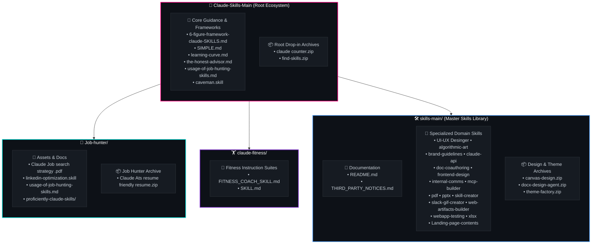

<div align="center">

<!-- ANIMATED RETRO PIXEL & MOTION HEADER -->
<svg xmlns="http://www.w3.org/2000/svg" viewBox="0 0 900 240" width="100%" height="240" style="background: #0d1117; border-radius: 16px; box-shadow: 0 8px 32px rgba(0,0,0,0.6); overflow: hidden;">
  <defs>
    <!-- Gradients -->
    <linearGradient id="neonGlow" x1="0%" y1="0%" x2="100%" y2="100%">
      <stop offset="0%" stop-color="#ff007f">
        <animate attributeName="stop-color" values="#ff007f;#7928ca;#00dfd8;#ff007f" dur="8s" repeatCount="indefinite" />
      </stop>
      <stop offset="50%" stop-color="#7928ca">
        <animate attributeName="stop-color" values="#7928ca;#00dfd8;#ff007f;#7928ca" dur="8s" repeatCount="indefinite" />
      </stop>
      <stop offset="100%" stop-color="#00dfd8">
        <animate attributeName="stop-color" values="#00dfd8;#ff007f;#7928ca;#00dfd8" dur="8s" repeatCount="indefinite" />
      </stop>
    </linearGradient>

    <linearGradient id="gridGrad" x1="0%" y1="0%" x2="0%" y2="100%">
      <stop offset="0%" stop-color="#00dfd8" stop-opacity="0.0" />
      <stop offset="100%" stop-color="#7928ca" stop-opacity="0.35" />
    </linearGradient>

    <!-- Scanline Filter -->
    <pattern id="pixelGrid" width="12" height="12" patternUnits="userSpaceOnUse">
      <rect width="12" height="12" fill="none" stroke="#ffffff" stroke-width="0.5" stroke-opacity="0.04"/>
    </pattern>
  </defs>

  <style>
    .title-text {
      font-family: 'Courier New', Courier, monospace, 'Segoe UI', sans-serif;
      font-weight: 900;
      font-size: 38px;
      fill: url(#neonGlow);
      letter-spacing: 4px;
    }
    .sub-text {
      font-family: 'Segoe UI', Tahoma, Geneva, Verdana, sans-serif;
      font-size: 14px;
      fill: #8b949e;
      letter-spacing: 2px;
    }
    .pixel-block {
      transform-origin: center;
      animation: pulse 2.5s ease-in-out infinite alternate;
    }
    .pixel-float-1 { animation: float 3s ease-in-out infinite alternate; }
    .pixel-float-2 { animation: float 4s ease-in-out infinite alternate-reverse; }
    .pixel-float-3 { animation: float 2.2s ease-in-out infinite alternate; }
    .cyber-line {
      stroke-dasharray: 8 4;
      animation: dash 20s linear infinite;
    }
    .star-twinkle {
      animation: twinkle 1.8s ease-in-out infinite alternate;
    }

    @keyframes dash {
      to { stroke-dashoffset: 1000; }
    }
    @keyframes float {
      0% { transform: translateY(0px) rotate(0deg); }
      100% { transform: translateY(-10px) rotate(4deg); }
    }
    @keyframes pulse {
      0% { opacity: 0.3; transform: scale(0.96); }
      100% { opacity: 0.9; transform: scale(1.04); }
    }
    @keyframes twinkle {
      0% { opacity: 0.1; transform: scale(0.6); }
      100% { opacity: 1; transform: scale(1.2); }
    }
  </style>

  <!-- Background Grid -->
  <rect width="900" height="240" fill="#0b0e14" />
  <rect width="900" height="240" fill="url(#pixelGrid)" />
  <rect y="120" width="900" height="120" fill="url(#gridGrad)" />

  <!-- Animated Horizon Lines / Motions -->
  <line x1="0" y1="180" x2="900" y2="180" stroke="#7928ca" stroke-width="1.5" stroke-opacity="0.4" class="cyber-line" />
  <line x1="0" y1="205" x2="900" y2="205" stroke="#00dfd8" stroke-width="1" stroke-opacity="0.3" class="cyber-line" />
  <line x1="0" y1="225" x2="900" y2="225" stroke="#ff007f" stroke-width="0.8" stroke-opacity="0.2" class="cyber-line" />

  <!-- Pixel Art Floating Particles -->
  <g class="star-twinkle" style="transform-origin: 120px 45px;"><rect x="118" y="43" width="6" height="6" fill="#00dfd8" /></g>
  <g class="star-twinkle" style="transform-origin: 780px 50px; animation-delay: 0.6s;"><rect x="778" y="48" width="8" height="8" fill="#ff007f" /></g>
  <g class="star-twinkle" style="transform-origin: 820px 140px; animation-delay: 1.2s;"><rect x="818" y="138" width="5" height="5" fill="#7928ca" /></g>
  <g class="star-twinkle" style="transform-origin: 80px 150px; animation-delay: 0.9s;"><rect x="78" y="148" width="7" height="7" fill="#00dfd8" /></g>

  <!-- Pixel Art Retro Character / Sprite Box Left -->
  <g class="pixel-float-1" transform="translate(45, 55)">
    <rect x="0" y="0" width="48" height="48" rx="8" fill="#161b22" stroke="url(#neonGlow)" stroke-width="2"/>
    <!-- Pixel Face -->
    <rect x="12" y="14" width="6" height="6" fill="#00dfd8" />
    <rect x="30" y="14" width="6" height="6" fill="#00dfd8" />
    <rect x="14" y="28" width="20" height="4" fill="#ff007f" />
    <rect x="10" y="24" width="4" height="4" fill="#ff007f" />
    <rect x="34" y="24" width="4" height="4" fill="#ff007f" />
  </g>

  <!-- Pixel Art Skill Orb Right -->
  <g class="pixel-float-2" transform="translate(805, 55)">
    <rect x="0" y="0" width="48" height="48" rx="8" fill="#161b22" stroke="url(#neonGlow)" stroke-width="2"/>
    <polygon points="24,10 38,24 24,38 10,24" fill="none" stroke="#00dfd8" stroke-width="2">
      <animateTransform attributeName="transform" type="rotate" from="0 24 24" to="360 24 24" dur="6s" repeatCount="indefinite"/>
    </polygon>
    <circle cx="24" cy="24" r="4" fill="#ff007f">
      <animate attributeName="r" values="3;5;3" dur="2s" repeatCount="indefinite"/>
    </circle>
  </g>

  <!-- Central Title and Subtitle -->
  <g text-anchor="middle">
    <!-- Glowing Badge Top -->
    <rect x="350" y="28" width="200" height="24" rx="12" fill="#1f242c" stroke="#30363d" stroke-width="1"/>
    <text x="450" y="44" font-family="'Segoe UI', sans-serif" font-size="11" font-weight="bold" fill="#58a6ff" letter-spacing="1.5">⚡ AGENTIC SUPERPOWERS ⚡</text>

    <!-- Main Title -->
    <text x="450" y="105" class="title-text">CLAUDE SKILLS ECOSYSTEM</text>
    <text x="450" y="138" class="sub-text">⚡ MODULAR AGENT CAPABILITIES • HIGH-IMPACT WORKFLOWS ⚡</text>

    <!-- Animated Status Indicator -->
    <circle cx="360" cy="182" r="4" fill="#2ea043">
      <animate attributeName="opacity" values="1;0.2;1" dur="1.5s" repeatCount="indefinite"/>
    </circle>
    <text x="450" y="186" font-family="'Segoe UI', monospace" font-size="12" fill="#7ee787">SYSTEM ACTIVE • ALL MODULES &amp; ARCHIVES READY</text>
  </g>
</svg>

<br/>

<!-- BADGE ROW -->
<p align="center">
  
  
  
  
</p>

</div>

---

## 🌌 Overview

The **Claude Skills Ecosystem** is an advanced repository of modular instruction packages, domain-specialized frameworks, ready-to-run automation recipes, and curated zip archives. These modules equip **Claude**, **Gemini CLI**, **Cursor**, and agentic environments with repeatable workflows, dynamic tool integration, and high-precision execution routines.

> [!NOTE]
> All `.zip` archives included in this repository (`claude counter.zip`, `find-skills.zip`, `Claude Ats resume friendly resume.zip`, `canvas-design.zip`, `docx-design-agent.zip`, `theme-factory.zip`) are **preserved in their original archive format** for clean modular distribution and portable drop-in usage.

---

## ⚡ Motion & Architecture Map



---

## 📁 Repository Directory & File Inventory

Below is the complete itemized directory inventory covering all folder names, file names, and zip archives:

### 1. Root Level Components

| Item Name | Type | Description |
|---|:---:|---|
| [`6-figure-framework-claude-SKILLS.md`](file:///C:/Users/Lenovo/Documents/Claude-skills-main/Claude-skills-main/6-figure-framework-claude-SKILLS.md) | `File` | Framework guidelines for high-value consulting & engineering skill design |
| [`SIMPLE.md`](file:///C:/Users/Lenovo/Documents/Claude-skills-main/Claude-skills-main/SIMPLE.md) | `File` | Minimalist execution guide and core principles |
| [`learning-curve.md`](file:///C:/Users/Lenovo/Documents/Claude-skills-main/Claude-skills-main/learning-curve.md) | `File` | Step-by-step master roadmap for adopting agentic workflows |
| [`the-honest-advisor.md`](file:///C:/Users/Lenovo/Documents/Claude-skills-main/Claude-skills-main/the-honest-advisor.md) | `File` | Direct, unfiltered strategic advisory persona & guidelines |
| [`usage-of-job-hunting-skills.md`](file:///C:/Users/Lenovo/Documents/Claude-skills-main/Claude-skills-main/usage-of-job-hunting-skills.md) | `File` | Quickstart instructions for career and employment toolkits |
| [`caveman.skill`](file:///C:/Users/Lenovo/Documents/Claude-skills-main/Claude-skills-main/caveman.skill) | `File` | Concise, ultra-efficient token-saving skill persona |
| [`claude counter.zip`](file:///C:/Users/Lenovo/Documents/Claude-skills-main/Claude-skills-main/claude%20counter.zip) | `Zip Archive` | Packaged token and interaction counter tool |
| [`find-skills.zip`](file:///C:/Users/Lenovo/Documents/Claude-skills-main/Claude-skills-main/find-skills.zip) | `Zip Archive` | Search & index discovery package for skill finding |
| [`Job-hunter`](file:///C:/Users/Lenovo/Documents/Claude-skills-main/Claude-skills-main/Job-hunter) | `Folder` | Career acceleration, resume builder, and job strategy suite |
| [`claude-fitness`](file:///C:/Users/Lenovo/Documents/Claude-skills-main/Claude-skills-main/claude-fitness) | `Folder` | Personalized workout, health, and fitness coaching skillset |
| [`skills-main`](file:///C:/Users/Lenovo/Documents/Claude-skills-main/Claude-skills-main/skills-main) | `Folder` | Comprehensive modular skills repository and utility packages |
| [`README.md`](file:///C:/Users/Lenovo/Documents/Claude-skills-main/Claude-skills-main/README.md) | `File` | Primary project navigation, animation hub, and catalog |

---

### 2. 💼 `Job-hunter/` Suite

Specialized career automation, resume optimization, and LinkedIn networking toolkit.

| File / Folder / Zip | Type | Purpose & Details |
|---|:---:|---|
| [`Claude Ats resume friendly resume.zip`](file:///C:/Users/Lenovo/Documents/Claude-skills-main/Claude-skills-main/Job-hunter/Claude%20Ats%20resume%20friendly%20resume.zip) | `Zip Archive` | Ready-to-use ATS-optimized resume templates & generators |
| [`Claude Job search strategy .pdf`](file:///C:/Users/Lenovo/Documents/Claude-skills-main/Claude-skills-main/Job-hunter/Claude%20Job%20search%20strategy%20.pdf) | `PDF File` | Comprehensive visual guide for structured job search strategies |
| [`linkedin-optimization.skill`](file:///C:/Users/Lenovo/Documents/Claude-skills-main/Claude-skills-main/Job-hunter/linkedin-optimization.skill) | `Skill File` | Profile optimization, headline enhancement, and engagement logic |
| [`usage-of-job-hunting-skills.md`](file:///C:/Users/Lenovo/Documents/Claude-skills-main/Claude-skills-main/Job-hunter/usage-of-job-hunting-skills.md) | `File` | Step-by-step workflow for job hunting tools |
| `proficiently-claude-skills/` | `Folder` | Dedicated extension directory for career skills |

---

### 3. 🏋️ `claude-fitness/` Module

Interactive health, endurance, hypertrophy, and nutritional programming agent.

| File Name | Type | Purpose & Details |
|---|:---:|---|
| [`FITNESS_COACH_SKILL.md`](file:///C:/Users/Lenovo/Documents/Claude-skills-main/Claude-skills-main/claude-fitness/FITNESS_COACH_SKILL.md) | `File` | Extended fitness coaching directives, periodization & nutrition |
| [`SKILL.md`](file:///C:/Users/Lenovo/Documents/Claude-skills-main/Claude-skills-main/claude-fitness/SKILL.md) | `File` | Core configuration, persona definition & routine planner |

---

### 4. 🛠️ `skills-main/` Core Skills Library

Located at [`skills-main/skills-main/skills`](file:///C:/Users/Lenovo/Documents/Claude-skills-main/Claude-skills-main/skills-main/skills-main/skills), containing production-grade domain agents:

```
skills-main/skills-main/
├── README.md                      # Library documentation
├── THIRD_PARTY_NOTICES.md         # Open source notices & licenses
├── spec/                          # Skill specification schemas
├── template/                      # Starter templates for new skills
└── skills/
    ├── canvas-design.zip          # [ZIP] HTML5 Canvas & interactive visual design package
    ├── docx-design-agent.zip      # [ZIP] Automated Word document styling & design agent
    ├── theme-factory.zip          # [ZIP] Palette & UI theme generator archive
    ├── Landing-page-contents/     # Copywriting & structural landing page builder
    ├── UI-UX Desinger/            # UI/UX wireframing, heuristic evaluations & flows
    ├── algorithmic-art/           # Generative p5.js / canvas mathematical art generator
    ├── brand-guidelines/          # Brand voice, typography, and color compliance checker
    ├── claude-api/                # Polyglot SDK guides (Python, TS, Go, Java, C#, PHP, Ruby, cURL)
    ├── doc-coauthoring/           # Collaborative technical writing & draft revision
    ├── frontend-design/           # Modern responsive web layout & component engine
    ├── internal-comms/            # Executive status updates, memos, and team announcements
    ├── mcp-builder/               # Model Context Protocol server creation suite
    ├── pdf/                       # PDF parsing, manipulation, and report synthesis
    ├── pptx/                      # PowerPoint presentation generation & slide layout
    ├── skill-creator/             # Interactive agent for authoring new skills
    ├── slack-gif-creator/         # Animated retro/pixel slack GIF generator
    ├── web-artifacts-builder/     # Interactive Claude React/HTML artifact creator
    ├── webapp-testing/            # Playwright/E2E browser testing & QA suite
    └── xlsx/                      # Excel formula, financial model, and sheet generator
```

---

## 🎮 Interactive Skills Navigator

<details>
<summary><b>🕹️ Click to Expand: Document & Media Generation Skills</b></summary>
<br/>

- **[`pptx`](file:///C:/Users/Lenovo/Documents/Claude-skills-main/Claude-skills-main/skills-main/skills-main/skills/pptx/SKILL.md)**: Generates complete PowerPoint slide decks using `pptxgenjs` and modern aesthetic layout standards.
- **[`pdf`](file:///C:/Users/Lenovo/Documents/Claude-skills-main/Claude-skills-main/skills-main/skills-main/skills/pdf/SKILL.md)**: Reads, slices, transforms, and renders structured PDF documents and forms.
- **[`xlsx`](file:///C:/Users/Lenovo/Documents/Claude-skills-main/Claude-skills-main/skills-main/skills/xlsx/SKILL.md)**: Creates formula-validated Excel spreadsheets, financial projections, and pivot models.
- **[`docx-design-agent.zip`](file:///C:/Users/Lenovo/Documents/Claude-skills-main/Claude-skills-main/skills-main/skills-main/skills/docx-design-agent.zip)**: Professional DOCX typography, header formatting, and document layout packaging.
- **[`slack-gif-creator`](file:///C:/Users/Lenovo/Documents/Claude-skills-main/Claude-skills-main/skills-main/skills-main/skills/slack-gif-creator/SKILL.md)**: Generates motion GIFs and pixel reactions tailored for team communication.

</details>

<details>
<summary><b>🎨 Click to Expand: Visual & Web Design Skills</b></summary>
<br/>

- **[`frontend-design`](file:///C:/Users/Lenovo/Documents/Claude-skills-main/Claude-skills-main/skills-main/skills-main/skills/frontend-design/SKILL.md)**: Production-grade HTML/CSS/Tailwind UI styling with modern responsive patterns.
- **[`UI-UX Desinger`](file:///C:/Users/Lenovo/Documents/Claude-skills-main/Claude-skills-main/skills-main/skills-main/skills/UI-UX%20Desinger/SKILL.md)**: User experience wireframing, UX heuristics, and micro-interaction specifications.
- **[`canvas-design.zip`](file:///C:/Users/Lenovo/Documents/Claude-skills-main/Claude-skills-main/skills-main/skills-main/skills/canvas-design.zip)**: Packaged suite for rendering dynamic HTML5 Canvas animations and particle effects.
- **[`theme-factory.zip`](file:///C:/Users/Lenovo/Documents/Claude-skills-main/Claude-skills-main/skills-main/skills-main/skills/theme-factory.zip)**: Pre-configured color harmony systems and dark/light theme tokens.
- **[`algorithmic-art`](file:///C:/Users/Lenovo/Documents/Claude-skills-main/Claude-skills-main/skills-main/skills-main/skills/algorithmic-art/SKILL.md)**: Generative geometry, SVG math art, and shader algorithms.

</details>

<details>
<summary><b>🚀 Click to Expand: Developer & Engineering Toolkits</b></summary>
<br/>

- **[`claude-api`](file:///C:/Users/Lenovo/Documents/Claude-skills-main/Claude-skills-main/skills-main/skills-main/skills/claude-api/SKILL.md)**: Direct API integration patterns across 8+ programming languages (Python, TypeScript, Go, Java, PHP, C#, Ruby, cURL).
- **[`mcp-builder`](file:///C:/Users/Lenovo/Documents/Claude-skills-main/Claude-skills-main/skills-main/skills-main/skills/mcp-builder/SKILL.md)**: Standardized creation of Model Context Protocol servers for tool calling.
- **[`webapp-testing`](file:///C:/Users/Lenovo/Documents/Claude-skills-main/Claude-skills-main/skills-main/skills-main/skills/webapp-testing/SKILL.md)**: End-to-end automated UI testing and regression assertion recipes.
- **[`web-artifacts-builder`](file:///C:/Users/Lenovo/Documents/Claude-skills-main/Claude-skills-main/skills-main/skills-main/skills/web-artifacts-builder/SKILL.md)**: Builds self-contained, reactive web apps inside Claude Artifacts.
- **[`skill-creator`](file:///C:/Users/Lenovo/Documents/Claude-skills-main/Claude-skills-main/skills-main/skills-main/skills/skill-creator/SKILL.md)**: Author, test, evaluate, and benchmark brand new skills.

</details>

<details>
<summary><b>💼 Click to Expand: Career & Advisory Frameworks</b></summary>
<br/>

- **[`6-figure-framework-claude-SKILLS.md`](file:///C:/Users/Lenovo/Documents/Claude-skills-main/Claude-skills-main/6-figure-framework-claude-SKILLS.md)**: Consulting blueprints for architecting high-value AI solutions.
- **[`Job-hunter`](file:///C:/Users/Lenovo/Documents/Claude-skills-main/Claude-skills-main/Job-hunter)**: ATS resume builder (`Claude Ats resume friendly resume.zip`), interview prep & strategy.
- **[`the-honest-advisor.md`](file:///C:/Users/Lenovo/Documents/Claude-skills-main/Claude-skills-main/the-honest-advisor.md)**: Brutally honest product and architecture reviews.
- **[`caveman.skill`](file:///C:/Users/Lenovo/Documents/Claude-skills-main/Claude-skills-main/caveman.skill)**: Hyper-condensed output persona producing rapid tokens and processing velocity.

</details>

---

## 🕹️ Quickstart & Skill Activation

To activate any skill or package in your agent environment:

1. **Direct Markdown Injection**: Point Claude / Cursor / Gemini to the specific skill file:
   ```markdown
   Please follow the instructions in skills-main/skills-main/skills/frontend-design/SKILL.md
   ```
2. **Packaged Zip Distribution**: Keep zip packages intact (`claude counter.zip`, `find-skills.zip`, `canvas-design.zip`, etc.) and supply them directly to platforms supporting archived tool bundles.
3. **Multi-Skill Chaining**: Combine skills (e.g., `skill-creator` + `mcp-builder` + `webapp-testing`) for end-to-end autonomous software development pipelines.

---

<div align="center">
  <sub>Built for the next generation of Agentic AI • Preserving clean modular structure</sub>
</div>
